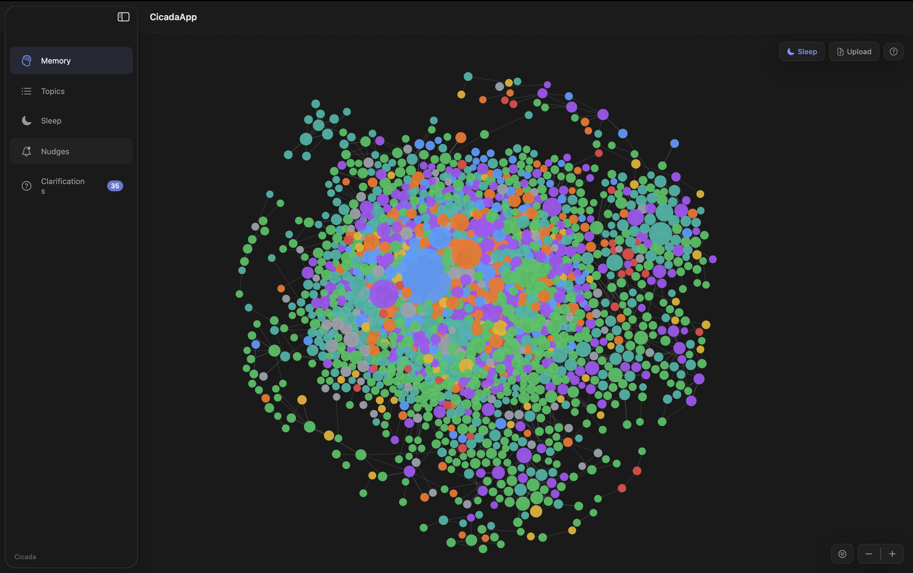
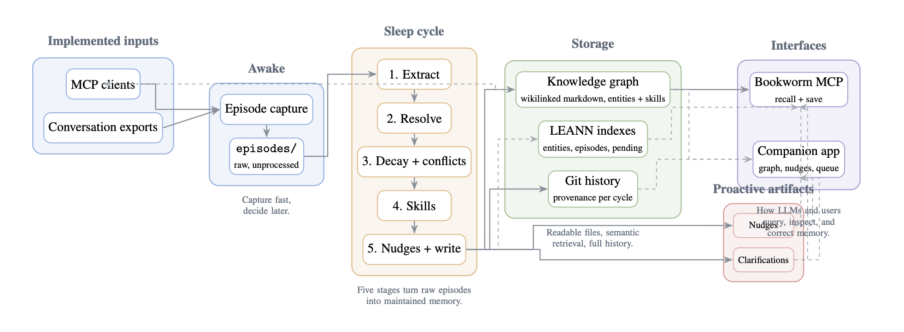

<div align="center">

# Cicada

**A local-first memory system for AI agents, built around an Awake and Sleep consolidation loop.**

Cicada captures raw conversational episodes during the day, then consolidates them at night into a markdown knowledge graph with semantic retrieval, explicit clarifications, nudges, and a native macOS companion app.

<p>
  
  
  
  
  
  
  
</p>

</div>

<p align="center">
  
</p>

## What Cicada is

Most agent memory systems either stay flat, a bag of retrieved chat snippets, or they hide their consolidation logic behind a managed product. Cicada takes a different route. The key idea here is that memory should be **captured cheaply**, **consolidated deliberately**, and **stored in a format both humans and models can inspect**.

That leads to a simple loop:

- **Awake**: log raw conversation episodes quickly, with no LLM work on capture.
- **Sleep**: run a staged consolidation pipeline that extracts entities, resolves duplicates, merges updates, decays stale memory, detects skills, and writes nudges or clarifications when the system is unsure.
- **Recall**: let any MCP-compatible client query the resulting memory through semantic search, markdown graph traversal, and explicit proactive memory artifacts.

This repository accompanies the Cicada capstone thesis and contains the full reference implementation: backend, MCP server, native companion app, and evaluation harness.

## Why it is interesting

- **Markdown is the source of truth.** Memory lives in plain files, not in a hidden vendor store.
- **The consolidation loop is explicit.** You can inspect what changed in every Sleep cycle.
- **Uncertainty is first-class.** Cicada creates clarifications instead of silently guessing.
- **The graph is local and inspectable.** The companion app shows the memory as it actually exists on disk.
- **Retrieval is hybrid.** LEANN handles semantic lookup, markdown handles structure, and git provides provenance.

## Architecture

<p align="center">
  
</p>

The Sleep cycle itself is a five-stage batch pipeline:

```text
[1] Entity and relationship extraction
                |
                v
[2] Entity resolution and deduplication
                |
                v
[3] Conflict resolution and temporal decay
                |
                v
[4] Pattern detection and skill extraction
                |
                v
[5] Nudges, clarifications, graph writes, git commit
```

## Repository layout

```text
cicada/
|-- api/             FastAPI backend and Sleep pipeline
|-- app/             Native macOS SwiftUI companion app
|-- mcp/             Bookworm MCP server
|-- benchmarks/      Evaluation harness for Table 1 / Table 3
|-- memory/          Local runtime workspace (gitignored separately in practice)
`-- README.md
```

## What is implemented today

- Awake capture through:
  - MCP episode saving
  - ChatGPT / Claude export upload
- Sleep consolidation with:
  - entity extraction
  - duplicate resolution
  - contradiction handling
  - temporal decay
  - skill extraction
  - clarification queue
  - nudge generation
  - structured git commits
- Three LEANN indexes:
  - promoted entities
  - raw episodes
  - pending sub-threshold entities
- Companion app views:
  - memory graph
  - topics
  - sleep dashboard
  - nudges
  - clarifications
- Benchmark harness for:
  - three-condition recall evaluation
  - operational footprint measurements
  - threshold ablations

Planned extensions, but not yet part of the current implementation, include richer capture channels such as Telegram ingestion, bookmark / PDF ingestion, and a post-Sleep verification layer.

## Setup

### Requirements

- macOS 14+
- Python 3.12
- [uv](https://github.com/astral-sh/uv)
- Xcode command line tools
- an OpenAI API key for embeddings and the default Sleep-cycle model

### 1. Clone the repo

```sh
git clone https://github.com/rorosaga/cicada.git
cd cicada
```

### 2. Set up the backend with `uv`

```sh
cd api
uv sync
cp .env.example .env
```

Then edit `api/.env` and set at least:

```sh
CICADA_MEMORY_PATH=/absolute/path/to/cicada/memory
OPENAI_API_KEY=sk-...
```

The current default model setup is:

```sh
CICADA_LITELLM_MODEL=gpt-5.4-mini
CICADA_LITELLM_DISAMBIGUATION_MODEL=gpt-5.4-nano
```

### 3. Run the backend

For the most reliable local development workflow, start the API manually first:

```sh
cd /path/to/cicada
source api/.venv/bin/activate
uvicorn api.main:app --host 127.0.0.1 --port 8000
```

This serves the companion app API on `127.0.0.1:8000`.

### 4. Run the macOS app

In a second terminal:

```sh
cd /path/to/cicada/app/CicadaApp
swift run
```

That launches the SwiftUI app. In development, it is safer to keep the backend running manually as above. The app contains backend-launching logic, but the manual two-terminal flow is the most predictable setup for now.

## Running the project

### Manual Sleep cycle

Once the backend is up, you can trigger a Sleep cycle from the app or through the API:

```sh
curl -X POST http://127.0.0.1:8000/sleep/trigger
```

Check status:

```sh
curl -s http://127.0.0.1:8000/sleep/status
```

### Upload conversation exports

The app exposes an upload flow for supported export formats, and the backend parses them into episode markdown files under `memory/episodes/`.

Currently supported export families include ChatGPT and Claude export formats handled by `api/routers/conversations.py`.

## MCP tools

The Bookworm MCP server exposes four tools:

- `cicada_recall`
- `cicada_recall_detail`
- `cicada_save_episode`
- `cicada_check_nudges`

At answer time, Cicada with Sleep does not just hand an LLM a single node. The retrieval layer can combine:

- semantic entity hits from LEANN
- keyword fallback over markdown pages
- one-hop traversal over related entities
- raw episode excerpts
- relevant nudges
- relevant clarifications

That retrieval context is then passed to the answer model.

## Benchmarks

The benchmark harness reproduces the thesis evaluation.

First create local, gitignored benchmark inputs:

```sh
cp benchmarks/questions.example.yaml benchmarks/questions.local.yaml
cp benchmarks/queries.example.txt benchmarks/queries.local.txt
```

Then edit the local files with your own benchmark content.

### Rebuild the episode index

```sh
make rebuild-episodes
```

### Run Table 1

```sh
make table1 QUESTIONS=benchmarks/questions.local.yaml
```

### Run Table 3

```sh
make table3 QUERIES=benchmarks/queries.local.txt
```

Outputs land in:

```text
benchmark_results/table1/
benchmark_results/table3/
```

Use `make help` to see the full benchmark command set, including the ablation runner and the sleep-timing variants.

## Notes on the memory workspace

The `memory/` directory is the live workspace. It contains:

- `episodes/`
- `entities/`
- `nudges/`
- `clarifications/`
- `leann/`
- `graph_edges.yaml`

Each Sleep cycle writes changes there and then commits them in the memory git repo, so provenance is recoverable through git history and line-level blame.

## Development philosophy

Cicada is opinionated about memory:

- capture first, decide later
- consolidate in batches, not on every keystroke
- keep the memory artifacts readable
- prefer explicit uncertainty over silent guessing
- treat absence of mention as a signal, not as empty noise

That is why the system is markdown-backed, graph-shaped, and Sleep-driven instead of being just another vector store attached to a chatbot.

## Current limitations

- the companion app is macOS-only
- entity pages are still more compressed than they should be
- the graph can be flatter than ideal for high-level topic organization
- some planned capture channels are still future work
- benchmark scoring is still human-scored rather than judge-modeled

## If you want to contribute

Issues, experiments, and implementation feedback are welcome. The most valuable future work is probably:

- richer entity-page synthesis
- better higher-level topic abstraction in the graph
- stronger clarification-aware answer synthesis
- more capture channels
- a verification layer after Sleep, before writeback
