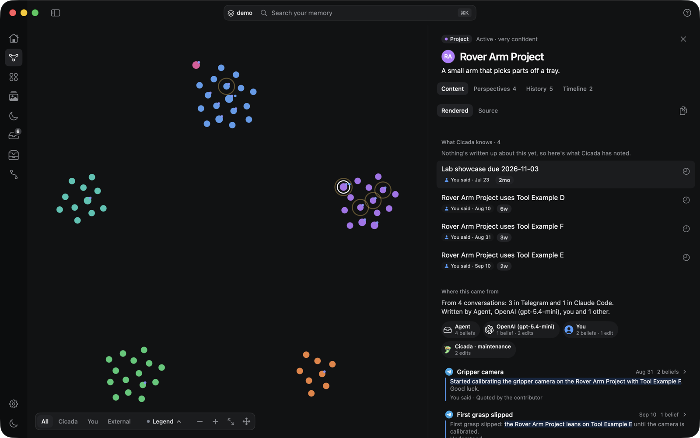
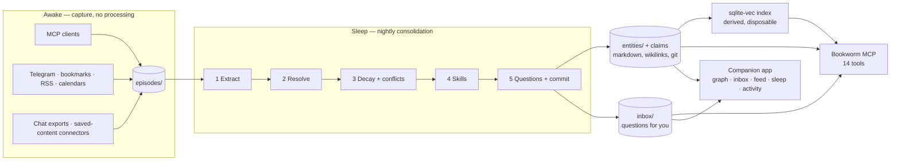
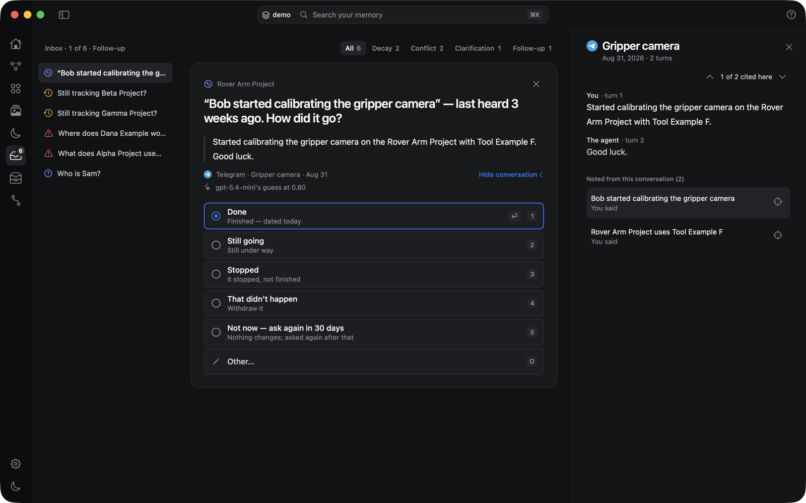
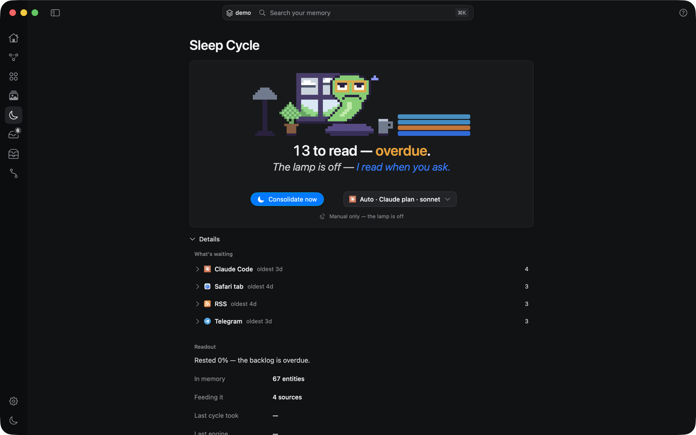
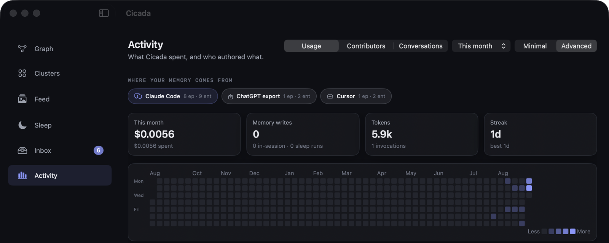

# Cicada

<p align="center">
  <strong>A memory system that turns a person's experience into something agents can read, extend, and reason over.</strong>
</p>

<p align="center">
  
  
  
  
  
  
</p>

<p align="center">
  
</p>

Cicada captures what you read, save, decide and talk about, consolidates it overnight into a
versioned knowledge graph of plain markdown files, and exposes that graph to any agent over MCP.
Agents read it, write to it with provenance, and ask you when they are unsure. You keep a native
macOS app to see exactly what they believe, why, and since when.

It runs entirely on your machine. The memory bank is a folder of markdown and a git repo. There is
no database and no cloud service; the only network calls are the ones you configure (a model API,
your Claude subscription, or a local Ollama).

## Why

Two ideas frame the design.

**The person's life is the environment.** Silver and Sutton's *Welcome to the Era of Experience*
argues that the next agents will learn from streams of experience grounded in an environment,
not from snippets of human text. Cicada's reading: a conversation is a snippet, a life is a
stream, and Cicada is the instrument that turns the stream into something an agent can inhabit.
Every capture channel is an observation. Every agent write with provenance is an action on a
shared record. Every time you answer a question, keep or archive something, or overrule a belief,
that is a reward signal from the environment, and Cicada records it as one.

**Raw experience, a wiki, and skills are three different layers.** Tang et al.'s *WikiSkill*
shows that separating raw experience from a persistent wiki from executable skills is what makes
agent skills improve and transfer across models. Cicada already holds the first two: `episodes/`
is the raw layer, and the entity-plus-claim graph, with its author and session trailers, is the
wiki. Compiling what the graph knows about how you work into portable skills that load into any
harness on any plan is the next layer.

The consequence for the code: memory must be **legible to an agent without ceremony**. An agent
should arrive, be told what Cicada is, read the graph, contribute with provenance, and leave the
store better than it found it. Markdown, git, typed claims, and the MCP surface all exist for that.

## How it works

The architecture is biologically inspired.


```mermaid
flowchart LR
  subgraph Awake["Awake — capture, no processing"]
    A1[MCP clients]
    A2[Telegram · bookmarks · RSS · calendars]
    A3[Chat exports · saved-content connectors]
    A1 & A2 & A3 --> E[(episodes/)]
  end
  subgraph Sleep["Sleep — nightly consolidation"]
    S1[1 Extract] --> S2[2 Resolve] --> S3[3 Decay + conflicts] --> S4[4 Skills] --> S5[5 Questions + commit]
  end
  E --> S1
  S5 --> G[(entities/ + claims\nmarkdown, wikilinks, git)]
  S5 --> I[(inbox/\nquestions for you)]
  G --> V[sqlite-vec index\nderived, disposable]
  G & I & V --> M[Bookworm MCP\n14 tools]
  G & I --> App[Companion app\ngraph · inbox · feed · sleep · activity]
```

- **Awake** is hippocampal encoding: everything is captured as a timestamped episode with no
  model call at capture time. Capture is file I/O.
- **Sleep** is cortical consolidation: a five-stage batch that extracts entities and typed
  claims, resolves them against the existing graph, detects contradictions, distills recurring
  patterns into skills, and writes questions to your inbox. Each cycle is one git commit whose
  message names every file it touched, which episode caused it, and which model wrote it.
- **Temporal decay** is synaptic homeostasis: absence of mention is itself a signal. Entities
  you stop talking about lose confidence, get a "still relevant?" question, and eventually
  archive. Mention them again and they come back.

Beliefs live in a **claim layer** with bi-temporal validity, an observer, and a trust level, so an
agent can reason over the record structurally instead of re-reading prose. Every commit carries
`Cicada-Author:` (which model or `user`), `Cicada-Session:` (which conversation), and
`Cicada-Engine:` trailers, so `git blame` on an entity page answers "who believed this, and why".

## Screenshots

All screenshots come from a synthetic demo bank. Nothing in them is real.

| Inbox — questions Sleep left for you | Sleep — the queue and the last cycle |
|---|---|
|  |  |

Activity — what was spent, where memory came from, who authored what:



The app is the management layer, not the primary interface. The primary interface is whatever
agent you already talk to.

## Quick start

Requirements: macOS 14+, Python 3.12, [uv](https://github.com/astral-sh/uv), Xcode command
line tools. For consolidation you need one of: a Claude subscription with the `claude` CLI, a
local [Ollama](https://ollama.com), or an API key for any provider litellm supports.

```sh
git clone https://github.com/rorosaga/cicada.git
cd cicada
./install.sh          # venv, memory dir, api/.env, MCP registration, launchd backend
make dev              # build the app, install to ~/Applications, launch
```

`install.sh` is idempotent and state-checks every step; re-run it whenever you want. It registers
the backend as a `launchd` agent that starts on login, and registers the `cicada` MCP server with
Claude Code. Check health any time with `make doctor`.

First launch opens a four-step sheet — your name, a consolidation engine, one capture channel, and
your first Sleep cycle — or "try a demo bank first" if you'd rather look around before wiring in
your own life. Re-open it any time from Settings → General → "Run setup again".

Pick a consolidation engine in `api/.env`:

```sh
CICADA_LLM_MODE=auto    # agent: your `claude` CLI on your subscription
                        # local: Ollama, offline, no key
                        # byok:  any litellm provider via *_API_KEY
                        # auto:  agent if connected, else local if running, else byok
```

Day-to-day commands:

| Command | What it does |
|---|---|
| `make dev` | Rebuild debug, reinstall over `~/Applications/Cicada.app`, relaunch |
| `make install-app` | Release build, install without relaunch |
| `make doctor` | Backend, MCP, and environment health checks |
| `curl -X POST -H "Authorization: Bearer $(cat ~/.cicada/api_token)" localhost:8000/sleep/trigger` | Run a Sleep cycle now (also a button in the app) |
| `api/.venv/bin/python -m pytest api/tests -q` | Backend suite |
| `cd app/CicadaApp && swift test` | App suite |

Never `swift run` the app: it produces a bundle-less executable whose window never becomes key,
which silently breaks graph clicks and text-field focus.

## Talking to it

Once registered, any MCP client sees 14 `cicada_*` tools. The ones you will meet first:

- `cicada_recall` / `cicada_recall_detail` — semantic plus structural search over the graph,
  following wikilinks for depth.
- `cicada_save_episode` / `cicada_save_url` — capture the current exchange or a link, with a
  reason if you give one.
- `cicada_write_claim` — write a typed belief with provenance.
- `cicada_check_nudges` / `cicada_resolve_inbox` — surface an open question relevant to the
  conversation and record your answer.
- `cicada_ask` — a grounded answer over the graph with citations and a gap analysis.

Capture also comes from a Telegram bot (`/save`, `/note`, `/remind`), Safari and Chrome
bookmarks, RSS feeds, ICS calendars, ChatGPT and Claude exports, and direct connectors for
Pinterest, Reddit, and X saved items. All of it lands in the same episode queue and goes through
the same Sleep pipeline.

## Repository layout

```
api/         FastAPI backend: routers, services (sleep cycle, claims, decay, connectors), tests
app/         SwiftUI macOS companion app (d3-force graph in a WKWebView)
mcp/         the Bookworm MCP server
memory/      your runtime bank — gitignored, never committed here
benchmarks/  thesis evaluation tooling
docs/goals/  the backlog (memory-evolution.md) and the handoff (TODO.md)
```

`CLAUDE.md` is the engineering manual: architecture, schemas, rulings, and rails. Read it before
changing anything. `docs/goals/memory-evolution.md` is the backlog, one numbered row per idea with
its evidence, and `docs/goals/TODO.md` is the execution order plus a handoff written for an agent
picking the project up cold.

## Status

Cicada started as a BSc capstone thesis at IE University and is now a personal project with a
larger goal: a port between a human's experience and the agents that will act on it. `main` is
the promoted branch; `dev` is where work happens, and PRs open against `dev`.

What works today: the full Awake/Sleep loop, the claim layer, decay classes, the unified inbox
with Claude Code-style questions, a sync engine that keeps the app live over SSE, consumption
tracking per model and plan, entity logos, repo links, and the capture channels listed above. What
is next is in the backlog; the rows most worth reading are the ones tagged with the two papers
above.

## Privacy

The bank is yours and stays on disk. This repository never contains bank content: test fixtures
use placeholder names, screenshots come from a synthetic demo bank, and the backlog quotes the
author's own ideas but never anyone else's data. If you find something that breaks that rule, open
an issue.

## License

See [LICENSE](LICENSE).
